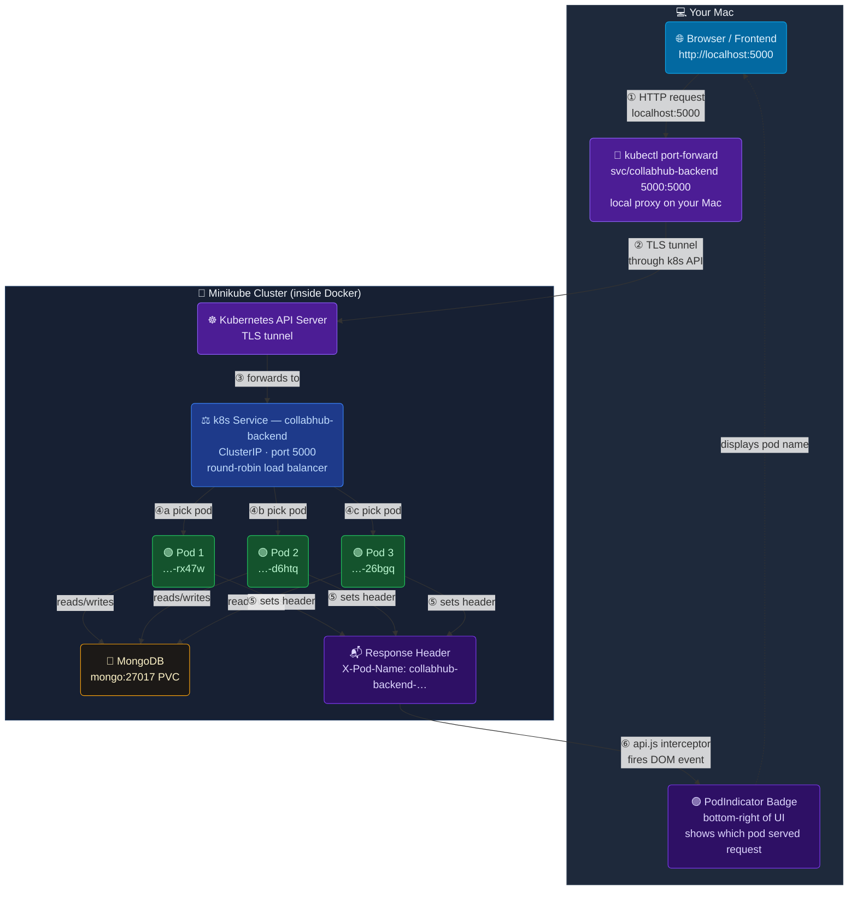

```mermaid
flowchart TD
    Browser("🌐 Browser / Frontend\nhttp://localhost:5000")
    PF("🔌 kubectl port-forward\nsvc/collabhub-backend 5000:5000\nlocal proxy on your Mac")
    API("☸️ Kubernetes API Server\nTLS tunnel")
    SVC("⚖️ k8s Service — collabhub-backend\nClusterIP · port 5000\nround-robin load balancer")
    P1("🟢 Pod 1\n…-rx47w")
    P2("🟢 Pod 2\n…-d6htq")
    P3("🟢 Pod 3\n…-26bgq")
    DB("🍃 MongoDB\nmongo:27017  PVC")
    HDR("📬 Response Header\nX-Pod-Name: collabhub-backend-…")
    BADGE("🟣 PodIndicator Badge\nbottom-right of UI\nshows which pod served request")

    Browser -->|"① HTTP request\nlocalhost:5000"| PF
    PF -->|"② TLS tunnel\nthrough k8s API"| API
    API -->|"③ forwards to"| SVC
    SVC -->|"④a pick pod"| P1
    SVC -->|"④b pick pod"| P2
    SVC -->|"④c pick pod"| P3
    P1 & P2 & P3 -->|"reads/writes"| DB
    P1 & P2 & P3 -->|"⑤ sets header"| HDR
    HDR -->|"⑥ api.js interceptor\nfires DOM event"| BADGE
    BADGE -.->|"displays pod name"| Browser

    subgraph MAC["💻 Your Mac"]
        Browser
        PF
        BADGE
    end

    subgraph CLUSTER["🐳 Minikube Cluster  (inside Docker)"]
        API
        SVC
        P1
        P2
        P3
        DB
        HDR
    end

    style MAC fill:#1e293b,stroke:#334155,color:#f1f5f9
    style CLUSTER fill:#172033,stroke:#1e3a5f,color:#f1f5f9

    style Browser fill:#0369a1,stroke:#0ea5e9,color:#e0f2fe
    style PF fill:#4c1d95,stroke:#8b5cf6,color:#ede9fe
    style API fill:#4c1d95,stroke:#8b5cf6,color:#ede9fe
    style SVC fill:#1e3a8a,stroke:#3b82f6,color:#bfdbfe
    style P1 fill:#14532d,stroke:#22c55e,color:#bbf7d0
    style P2 fill:#14532d,stroke:#22c55e,color:#bbf7d0
    style P3 fill:#14532d,stroke:#22c55e,color:#bbf7d0
    style DB fill:#1c1917,stroke:#f59e0b,color:#fef3c7
    style HDR fill:#2e1065,stroke:#7c3aed,color:#ddd6fe
    style BADGE fill:#2e1065,stroke:#7c3aed,color:#ddd6fe
```
