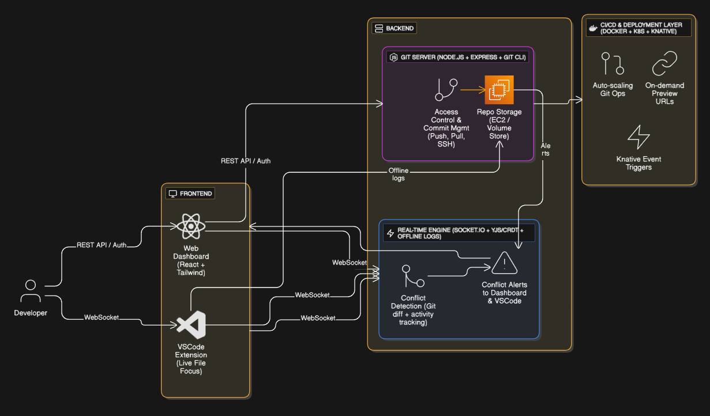

# CollabHub - Real-time Git Collaboration Platform

CollabHub is a comprehensive collaboration platform that combines a modern web interface, backend server, and VS Code extension to enhance team collaboration in Git-based projects. It provides real-time conflict detection, change tracking, and seamless repository management.

## 🔄 Process Flow



The above diagram illustrates the interaction between different components of the CollabHub platform and how they work together to provide real-time collaboration features.

## 🌟 Features

- **Real-time Collaboration**: Track changes and conflicts across your team in real-time
- **Modern Web Interface**: Built with React and TailwindCSS for a beautiful, responsive experience
- **VS Code Integration**: Native extension for conflict detection and branch management
- **Repository Management**: Easy-to-use interface for managing Git repositories
- **Commit History**: Visual commit log and change tracking
- **File Browser**: Browse and manage repository files with ease

## 🏗️ Project Structure

The project consists of three main components:

### 1. Frontend (`/collabFrontend`)
A modern React application built with:
- React 18
- Vite
- TailwindCSS
- React Router DOM
- Axios for API communication

### 2. Backend (`/backend`)
An Express.js server providing:
- Repository management
- Codebase operations
- Commit tracking
- Logging system
- Authentication middleware

### 3. VS Code Extension (`/extension`)
A VS Code extension for:
- Real-time conflict detection
- Branch management
- Change tracking
- Direct integration with CollabHub server

## 📚 Documentation

For comprehensive documentation, please refer to:

- **[API Documentation](docs/API.md)** - Complete REST API reference
- **[Architecture Guide](docs/ARCHITECTURE.md)** - System design and architecture
- **[Deployment Guide](docs/DEPLOYMENT.md)** - Production deployment instructions  
- **[Contributing Guidelines](docs/CONTRIBUTING.md)** - How to contribute to the project
- **[Troubleshooting Guide](docs/TROUBLESHOOTING.md)** - Common issues and solutions

### Component Documentation
- **[Frontend README](collabFrontend/README.md)** - React application documentation
- **[Backend README](backend/README.md)** - Express.js server documentation
- **[Extension README](extension/collabhub-conflict-detection/README.md)** - VS Code extension documentation

## 🚀 Getting Started

### Prerequisites
- Node.js (v14 or higher)
- Git
- VS Code (for extension development)

### Quick Start
1. **Clone the repository**:
   ```bash
   git clone https://github.com/Sridhar1030/CollabHub.git
   cd CollabHub
   ```

2. **Backend Setup**:
   ```bash
   cd backend
   npm install
   npm run dev
   ```

3. **Frontend Setup**:
   ```bash
   cd ../collabFrontend
   npm install
   npm run dev
   ```

4. **VS Code Extension Setup**:
   ```bash
   cd ../extension/collabhub-conflict-detection
   npm install
   # Press F5 in VS Code to start debugging
   ```

Visit `http://localhost:3000` to access the application.

## 🛠️ Development Scripts

### Frontend
- `npm run dev` - Start development server with hot reload
- `npm run build` - Build for production
- `npm run preview` - Preview production build
- `npm run lint` - Run ESLint for code quality

### Backend
- `npm run dev` - Start development server
- `npm start` - Start production server
- `npm test` - Run tests (when implemented)

### VS Code Extension
- `npm run lint` - Run ESLint
- `npm run test` - Run extension tests
- `vsce package` - Package extension for distribution

## 🔧 Configuration

### Environment Variables

#### Backend Configuration
Create `.env` files for different environments:

```bash
# .env.development
NODE_ENV=development
PORT=5000
EC2_API_URL=http://13.200.241.196:3000
DEBUG=true

# .env.production  
NODE_ENV=production
PORT=5000
EC2_API_URL=http://13.200.241.196:3000
LOG_LEVEL=info
```

#### Frontend Configuration
```bash
# .env.development
VITE_API_URL=http://localhost:5000
VITE_WS_URL=ws://localhost:5000

# .env.production
VITE_API_URL=https://api.yourdomain.com
VITE_WS_URL=wss://api.yourdomain.com
```

### Configuration Files
- **Frontend**: `vite.config.js`, `tailwind.config.js`, `eslint.config.js`
- **Backend**: `config/constants.js`, `package.json`
- **Extension**: `package.json` contributes section, `.vscode/launch.json`

For detailed configuration options, see the respective component documentation.

## 🤝 Contributing

We welcome contributions from the community! Please read our [Contributing Guidelines](docs/CONTRIBUTING.md) for detailed information on:

- Code of Conduct
- Development setup
- Coding standards
- Pull request process
- Issue reporting

### Quick Contribution Steps
1. Fork the repository
2. Create a feature branch (`git checkout -b feature/AmazingFeature`)
3. Make your changes and add tests
4. Commit your changes (`git commit -m 'Add some AmazingFeature'`)
5. Push to the branch (`git push origin feature/AmazingFeature`)
6. Open a Pull Request

For detailed guidelines, see [CONTRIBUTING.md](docs/CONTRIBUTING.md).

## 📄 License

This project is licensed under the MIT License - see the [LICENSE](LICENSE) file for details.

## 🆘 Support

If you encounter any issues or have questions:

1. Check the [Troubleshooting Guide](docs/TROUBLESHOOTING.md)
2. Search existing [GitHub Issues](https://github.com/Sridhar1030/CollabHub/issues)
3. Create a new issue with detailed information
4. Join our community discussions

## 🙏 Acknowledgments

- Built with modern web technologies
- Inspired by collaborative development needs
- Community contributions and feedback

---

Made with ❤️ by the CollabHub team

